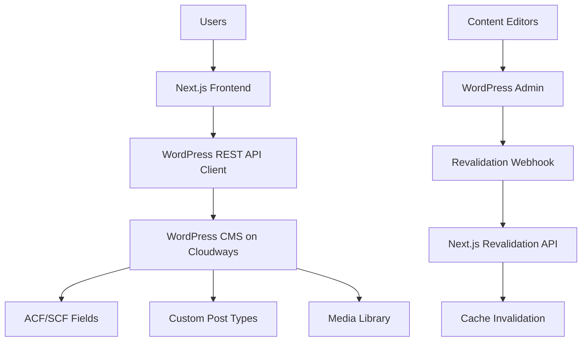

# Design Document - WordPress Migration

## Overview

This design document outlines the architecture for migrating the Zawaya platform from a hybrid Supabase + WordPress system to a WordPress-only architecture. The solution maintains the existing Next.js App Router frontend while establishing WordPress as the single source of truth for all content, using the WordPress REST API with Application Password authentication and Next.js built-in caching for optimal performance.

## Architecture

### High-Level Architecture



### Data Flow

1. **Content Creation**: Editors create/edit content in WordPress admin
2. **Webhook Trigger**: WordPress triggers revalidation webhook on publish/update
3. **Cache Invalidation**: Next.js receives webhook and invalidates relevant caches
4. **Content Fetching**: Next.js fetches fresh content from WordPress REST API
5. **Caching**: Next.js caches responses with appropriate revalidation intervals
6. **Content Delivery**: Users receive cached content with optimal performance

## Components and Interfaces

### WordPress REST API Client (`lib/wp.ts`)

```typescript
interface WordPressClient {
  // Core fetching method with authentication and caching
  wpGet(path: string, params?: Record<string, any>, options?: CacheOptions): Promise<any>
  
  // Content type specific methods
  getArticles(options: ArticleOptions): Promise<Article[]>
  getArticleBySlug(slug: string): Promise<Article | null>
  getPrograms(options?: ProgramOptions): Promise<Program[]>
  getProgramBySlug(slug: string): Promise<Program | null>
  getEpisodes(options: EpisodeOptions): Promise<Episode[]>
  getAuthors(options?: AuthorOptions): Promise<Author[]>
  getAuthorById(id: number): Promise<Author | null>
}

interface CacheOptions {
  revalidate?: number
  tags?: string[]
}

interface ArticleOptions {
  page?: number
  perPage?: number
  category?: string
  search?: string
  featured?: boolean
}
```

### Authentication Strategy

- **Method**: WordPress Application Passwords (Basic Auth over HTTPS)
- **Security**: Credentials stored in environment variables
- **Headers**: `Authorization: Basic ${base64(username:app_password)}`
- **HTTPS**: Required for secure credential transmission

### Caching Strategy

```typescript
interface CacheStrategy {
  // Static content (long cache)
  staticContent: {
    revalidate: 3600 // 1 hour
    tags: ['static']
  }
  
  // Dynamic content (medium cache)
  articles: {
    revalidate: 300 // 5 minutes
    tags: ['articles', 'content']
  }
  
  // Frequently updated (short cache)
  homepage: {
    revalidate: 60 // 1 minute
    tags: ['homepage', 'featured']
  }
}
```

## Data Models

### WordPress Content Types with SCF Mapping

```typescript
interface Article {
  id: number
  slug: string
  title: { rendered: string }
  content: { rendered: string }
  excerpt: { rendered: string }
  date: string
  modified: string
  author: number
  featured_media: number
  categories: number[]
  tags: number[]
  meta: {
    // Arabic content fields
    title_arabic?: string
    excerpt_arabic?: string
    content_arabic?: string
    author_arabic_name?: string
    author_bio_arabic?: string
    
    // Audio and media
    audio_narration_url?: string
    audio_duration?: number
    social_sharing_image?: string
    
    // Content metadata
    reading_time_minutes?: number
    category_color?: string
    is_featured?: boolean
    is_breaking_news?: boolean
    
    // SEO fields
    meta_description_arabic?: string
    keywords_arabic?: string
  }
  _embedded?: {
    author: Author[]
    'wp:featuredmedia': Media[]
    'wp:term': Term[][]
  }
}

interface Program {
  id: number
  slug: string
  title: { rendered: string }
  content: { rendered: string }
  date: string
  meta: {
    // Program details
    host_arabic?: string
    program_type: 'video' | 'audio' | 'mixed'
    theme_color?: string
    cover_image?: string
    
    // Statistics and metadata
    episode_count?: number
    average_duration?: number
    subscriber_count?: number
    program_rating?: number
    trailer_video?: string
  }
  _embedded?: {
    'wp:featuredmedia': Media[]
  }
}

interface Episode {
  id: number
  slug: string
  title: { rendered: string }
  content: { rendered: string }
  date: string
  meta: {
    // Episode media
    video_embed_url?: string
    audio_file_url?: string
    episode_poster?: string
    episode_thumbnail?: string
    
    // Episode metadata
    season_number?: number
    episode_number?: number
    duration_seconds?: number
    transcript_arabic?: string
    episode_gallery?: string[]
    episode_tags_arabic?: string
    scheduled_publish?: string
  }
}

interface Author {
  id: number
  slug: string
  name: string
  description: string
  meta: {
    // Arabic author fields
    name_arabic?: string
    job_title_arabic?: string
    bio_arabic?: string
    location_arabic?: string
    
    // Author media and verification
    author_avatar?: string
    author_cover_image?: string
    is_verified_author?: boolean
    is_featured_author?: boolean
    
    // Professional details
    expertise_areas?: string[]
    languages_spoken?: string[]
    social_media_links?: Array<{
      platform: string
      url: string
    }>
  }
}
```

### Response Transformation

```typescript
interface ResponseTransformer {
  transformArticle(wpPost: any): Article
  transformProgram(wpPost: any): Program
  transformEpisode(wpPost: any): Episode
  transformAuthor(wpUser: any): Author
  extractACFFields(wpPost: any): Record<string, any>
  processEmbeddedData(embedded: any): ProcessedEmbeds
}
```

## Error Handling

### Error Types and Responses

```typescript
enum WordPressErrorType {
  NETWORK_ERROR = 'network_error',
  AUTH_ERROR = 'auth_error',
  NOT_FOUND = 'not_found',
  SERVER_ERROR = 'server_error',
  RATE_LIMIT = 'rate_limit'
}

interface ErrorHandler {
  handleNetworkError(error: Error): Promise<any>
  handleAuthError(error: Error): Promise<any>
  handleNotFound(slug: string): Promise<any>
  handleServerError(error: Error): Promise<any>
  implementRetryLogic(request: () => Promise<any>): Promise<any>
}
```

### Fallback Strategies

1. **Cached Responses**: Serve stale cache when WordPress is unavailable
2. **Graceful Degradation**: Show partial content when some data is missing
3. **User-Friendly Messages**: Display helpful error messages in Arabic
4. **Retry Logic**: Exponential backoff for transient failures
5. **Monitoring**: Log errors for debugging and monitoring

## Testing Strategy

### Unit Tests

```typescript
describe('WordPress Client', () => {
  test('should authenticate with Application Password')
  test('should fetch articles with ACF fields')
  test('should handle network errors gracefully')
  test('should transform WordPress responses correctly')
  test('should implement proper caching headers')
})
```

### Integration Tests

```typescript
describe('WordPress Integration', () => {
  test('should fetch real content from WordPress API')
  test('should handle webhook revalidation')
  test('should maintain cache consistency')
  test('should work with ACF field configurations')
})
```

### End-to-End Tests

```typescript
describe('Content Flow', () => {
  test('should display WordPress content on pages')
  test('should update content after WordPress publish')
  test('should handle WordPress downtime gracefully')
  test('should maintain Arabic RTL functionality')
})
```

## Migration Strategy

### Phase-by-Phase Approach

1. **Phase 0**: Environment setup and WordPress configuration
2. **Phase 1**: Remove Supabase dependencies and admin UI
3. **Phase 2**: Implement WordPress REST API client
4. **Phase 3**: Update page data sources to use WordPress
5. **Phase 4**: Implement cache revalidation system
6. **Phase 5**: WordPress server configuration
7. **Phase 6**: Code cleanup and optimization
8. **Phase 7**: Testing and quality assurance

### Rollback Plan

- Maintain feature branch with WordPress-only implementation
- Keep previous Supabase version tagged for quick rollback
- Implement feature flags for gradual migration if needed
- Monitor performance and error rates during migration

## Performance Considerations

### Caching Layers

1. **Next.js Route Cache**: Automatic caching of route responses
2. **Data Cache**: Explicit caching of WordPress API responses
3. **CDN Cache**: Static asset caching via Vercel/CDN
4. **WordPress Cache**: Server-side caching on Cloudways

### Optimization Strategies

- **Selective Revalidation**: Only invalidate affected content
- **Batch Requests**: Combine multiple API calls when possible
- **Image Optimization**: Use Next.js Image component with WordPress media
- **Lazy Loading**: Load content progressively for better performance
- **Compression**: Enable gzip/brotli compression for API responses

## Security Considerations

### Authentication Security

- Store WordPress credentials in secure environment variables
- Use HTTPS for all API communications
- Implement rate limiting to prevent abuse
- Rotate Application Passwords regularly

### Data Validation

- Validate all WordPress API responses
- Sanitize content before rendering
- Implement CSRF protection for revalidation webhooks
- Use TypeScript for type safety

## SCF-to-UI Mapping Contract

### Page-Level Data Bindings

#### Homepage (/ar)
- **Featured article**: `post.meta.is_featured === true`
- **Latest articles**: Recent posts (limit 6-12)
- **Programs spotlight**: Program CPT (featured first)
- **Featured authors**: `user.meta.is_featured_author === true`

**UI Bindings:**
- Card title → `post.meta.title_arabic || post.title`
- Excerpt → `post.meta.excerpt_arabic || post.excerpt`
- Category badge → `post.meta.category_color`
- Read time → `post.meta.reading_time_minutes`
- Audio badge → Show if `post.meta.audio_narration_url`
- Program host → `program.meta.host_arabic`
- Author chip → `author.meta.name_arabic || author.name`

**Cache tags**: `['homepage', 'articles', 'programs', 'authors']`

#### Article Pages (/ar/articles)
- **List page**: Paginated posts with SCF
- **Detail page**: Single post + related posts

**UI Bindings:**
- H1 → `meta.title_arabic || post.title`
- Byline → `meta.author_arabic_name || post.author.name`
- Bio popover → `meta.author_bio_arabic`
- Audio player → `meta.audio_narration_url`, duration → `meta.audio_duration`
- Body → `meta.content_arabic || post.content`
- Social image → `meta.social_sharing_image || post.featured_image`

**Cache tags**: `['articles', 'article:'+post.id]`

#### Program Pages (/ar/programs)
- **List page**: Program CPT with metadata
- **Detail page**: Single program + episodes

**UI Bindings:**
- Cover → `meta.cover_image`
- Host → `meta.host_arabic`
- Type badge → `meta.program_type`
- Theme accent → `meta.theme_color`
- Stats → `meta.episode_count`, `meta.average_duration`, `meta.subscriber_count`

**Cache tags**: `['programs', 'program:'+program.id]`

#### Episode Pages (/ar/episodes/[slug])
**UI Bindings:**
- Video player → `meta.video_embed_url`
- Audio player → `meta.audio_file_url`
- Poster → `meta.episode_poster || meta.episode_thumbnail`
- Transcript → `meta.transcript_arabic`
- Gallery → `meta.episode_gallery`

**Cache tags**: `['episodes', 'episode:'+episode.id]`

#### Author Pages (/ar/authors)
**UI Bindings:**
- Avatar → `user.meta.author_avatar`
- Name → `user.meta.name_arabic || user.name`
- Title → `user.meta.job_title_arabic`
- Bio → `user.meta.bio_arabic`
- Socials → `user.meta.social_media_links[]`

**Cache tags**: `['authors', 'author:'+user.id]`

### Component Props Mapping

```typescript
// Component interfaces with SCF bindings
interface ArticleCardProps {
  title: string // meta.title_arabic || post.title
  excerpt: string // meta.excerpt_arabic || post.excerpt
  readTime: number // meta.reading_time_minutes
  categoryColor: string // meta.category_color
  featured: boolean // meta.is_featured
  audioUrl?: string // meta.audio_narration_url
}

interface ProgramCardProps {
  title: string // program.title
  host: string // meta.host_arabic
  cover: string // meta.cover_image
  type: 'video' | 'audio' | 'mixed' // meta.program_type
  episodeCount: number // meta.episode_count
  themeColor: string // meta.theme_color
}

interface EpisodeDetailProps {
  videoUrl?: string // meta.video_embed_url
  audioUrl?: string // meta.audio_file_url
  poster: string // meta.episode_poster
  transcript: string // meta.transcript_arabic
  gallery: string[] // meta.episode_gallery
  duration: number // meta.duration_seconds
}

interface AuthorProfileProps {
  name: string // meta.name_arabic || display_name
  title: string // meta.job_title_arabic
  avatar: string // meta.author_avatar
  cover: string // meta.author_cover_image
  verified: boolean // meta.is_verified_author
  featured: boolean // meta.is_featured_author
  socials: SocialLink[] // meta.social_media_links
}
```

### SEO and Metadata Mapping

```typescript
// SEO bindings by content type
interface SEOMapping {
  articles: {
    title: string // meta.title_arabic || post.title
    description: string // meta.meta_description_arabic || meta.excerpt_arabic
    image: string // meta.social_sharing_image || featured_image
    keywords: string // meta.keywords_arabic
  }
  programs: {
    title: string // program.title
    description: string // first paragraph or meta.meta_description_arabic
    image: string // meta.cover_image
    themeColor: string // meta.theme_color
  }
  episodes: {
    title: string // episode.title
    description: string // first 160 chars of meta.transcript_arabic
    image: string // meta.episode_poster || meta.episode_thumbnail
  }
  authors: {
    title: string // meta.name_arabic || display_name
    image: string // meta.author_avatar
    jobTitle: string // meta.job_title_arabic
  }
}
```

### Cache Revalidation Strategy

**Revalidation triggers** (WordPress webhook → Next.js):
- Article saved → tags `['articles', 'article:'+ID]`, paths `['/ar', '/ar/articles', '/ar/articles/[slug]']`
- Program saved → tags `['programs', 'program:'+ID]`, paths `['/ar/programs', '/ar/programs/[slug]']`
- Episode saved → tags `['episodes', 'episode:'+ID, 'program:'+PROGRAM_ID]`
- Featured toggles → also revalidate `/ar` (homepage)

## Monitoring and Observability

### Metrics to Track

- WordPress API response times
- Cache hit/miss ratios
- Error rates by error type
- Content freshness metrics
- User experience metrics (Core Web Vitals)
- SCF field usage and fallback rates

### Logging Strategy

- Log all WordPress API errors
- Track revalidation webhook calls
- Monitor cache performance
- Alert on critical failures
- Log SCF field mapping errors and fallbacks