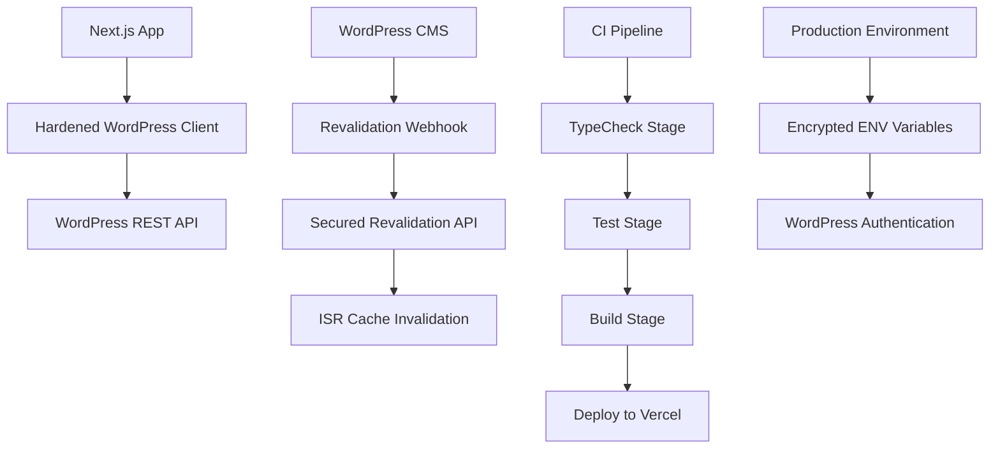

# Design Document - WordPress Production Readiness

## Overview

This design document outlines the technical approach for making the Next.js WordPress integration production-ready. The solution focuses on hardening the existing WordPress client, fixing TypeScript compilation issues, ensuring test reliability, securing the revalidation API, optimizing static generation, configuring production environments, and establishing a robust CI/CD pipeline.

## Architecture

### Current State Analysis

The WordPress integration is functional but has several production readiness gaps:
- WordPress client treats 404s as fatal errors causing build failures
- TypeScript compilation has export warnings from SCF mappings
- Test suite has flaky tests due to incorrect event mocking
- Revalidation API lacks proper security validation
- Pages missing ISR configuration for optimal caching
- Production environment variables not configured in Vercel
- CI pipeline lacks dependency caching and proper stages

### Target Architecture



## Components and Interfaces

### Enhanced WordPress Client (`lib/wordpress.ts`)

```typescript
interface WordPressClientConfig {
  baseUrl: string
  username: string
  appPassword: string
  defaultRevalidate: number
  retryConfig: {
    maxRetries: number
    baseDelay: number
    maxDelay: number
  }
}

interface WordPressResponse<T> {
  data: T[]
  headers: Record<string, string>
  total?: number
  totalPages?: number
}

interface ErrorHandlingStrategy {
  handle404AsEmpty: boolean
  retryOnServerError: boolean
  retryOnClientError: boolean
  fallbackToCache: boolean
}
```#
## SCF Mappings Type System

```typescript
// Fixed export pattern for lib/scf-mappings/article-mappings.ts
export type ArticleCardProps = {
  id: number
  title: string
  excerpt: string
  slug: string
  readTime?: number
  categoryColor?: string
  featured?: boolean
  audioUrl?: string
}

export type ArticleListProps = {
  articles: ArticleCardProps[]
  pagination: PaginationInfo
  filters: FilterOptions
}

export type ArticleDetailProps = {
  article: Article
  relatedArticles: ArticleCardProps[]
  author: AuthorInfo
}

// Re-export all types for consistent imports
export type {
  ArticleCardProps as ArticleCard,
  ArticleListProps as ArticleList,
  ArticleDetailProps as ArticleDetail
}
```

### Revalidation API Security

```typescript
interface RevalidationRequest {
  secret: string
  paths: string[]
  content_type: 'program' | 'episode' | 'post'
}

interface RevalidationResponse {
  success: boolean
  revalidated: string[]
  now: string
  durationMs: number
  error?: string
}

interface RevalidationConfig {
  secretToken: string
  pathMappings: {
    program: string[]
    episode: string[]
    post: string[]
  }
}
```

### Test Mocking Strategy

```typescript
interface TestMockConfig {
  htmlMediaElement: {
    duration: number
    currentTime: number
    paused: boolean
  }
  waveSurfer: {
    create: jest.Mock
    load: jest.Mock
    play: jest.Mock
    pause: jest.Mock
  }
  radixSlider: {
    eventType: 'input' // Not 'change'
    valueProperty: 'target.value'
  }
}
```

## Data Models

### Enhanced Error Handling

```typescript
enum WordPressErrorType {
  NOT_FOUND = 404,
  UNAUTHORIZED = 401,
  FORBIDDEN = 403,
  SERVER_ERROR = 500,
  BAD_GATEWAY = 502,
  SERVICE_UNAVAILABLE = 503,
  GATEWAY_TIMEOUT = 504
}

interface ErrorResponse {
  type: WordPressErrorType
  message: string
  shouldRetry: boolean
  fallbackData?: any
}

interface RetryConfig {
  maxRetries: number
  baseDelay: number
  maxDelay: number
  retryableStatuses: number[]
}
```

### ISR Configuration

```typescript
interface ISRConfig {
  revalidate: number // seconds
  tags?: string[]
  dynamicParams?: boolean
}

const pageConfigs: Record<string, ISRConfig> = {
  '/ar': { revalidate: 300 }, // 5 minutes
  '/ar/articles': { revalidate: 300 },
  '/ar/programs': { revalidate: 300 },
  '/ar/articles/[slug]': { revalidate: 300, tags: ['article'] },
  '/ar/programs/[slug]': { revalidate: 300, tags: ['program'] }
}
```

## Error Handling

### WordPress Client Error Strategy

1. **404 Responses**: Return `{ data: [], headers: {} }` instead of throwing
2. **Server Errors (≥500)**: Implement exponential backoff retry
3. **Client Errors (401, 403, 404)**: No retry, graceful handling
4. **Network Errors**: Fallback to cached data when available
5. **Timeout Errors**: Configurable timeout with fallback

### Retry Logic Implementation

```typescript
async function withRetry<T>(
  operation: () => Promise<T>,
  config: RetryConfig
): Promise<T> {
  let lastError: Error
  
  for (let attempt = 0; attempt <= config.maxRetries; attempt++) {
    try {
      return await operation()
    } catch (error) {
      lastError = error
      
      if (!shouldRetry(error, config) || attempt === config.maxRetries) {
        throw error
      }
      
      const delay = Math.min(
        config.baseDelay * Math.pow(2, attempt),
        config.maxDelay
      )
      await sleep(delay)
    }
  }
  
  throw lastError
}
```

## Testing Strategy

### Unit Test Improvements

```typescript
// Audio player test fixes
describe('AudioPlayer', () => {
  beforeEach(() => {
    Object.defineProperty(HTMLMediaElement.prototype, 'duration', {
      writable: true,
      value: 120
    })
    
    Object.defineProperty(HTMLMediaElement.prototype, 'currentTime', {
      writable: true,
      value: 0
    })
  })
  
  test('slider interaction', () => {
    const slider = screen.getByRole('slider')
    fireEvent.input(slider, { target: { value: '60' } }) // Not fireEvent.change
    expect(mockAudio.currentTime).toBe(60)
  })
})
```

### WaveSurfer Mocking

```typescript
jest.mock('wavesurfer.js', () => ({
  create: jest.fn(() => ({
    load: jest.fn(),
    play: jest.fn(),
    pause: jest.fn(),
    seekTo: jest.fn(),
    on: jest.fn(),
    destroy: jest.fn()
  }))
}))
```

### Cross-Environment Test Compatibility

- **Local (jsdom)**: Full DOM API support
- **CI (happy-dom)**: Lightweight DOM with essential APIs
- **Mocking Strategy**: Use lowest common denominator APIs
- **Polyfills**: Add necessary polyfills for missing APIs

## Performance Considerations

### ISR Optimization

```typescript
// Page-level ISR configuration
export const revalidate = 300 // 5 minutes

// Component-level caching
const cachedData = unstable_cache(
  async () => getWordPressData(),
  ['wp-data'],
  { revalidate: 300, tags: ['wordpress'] }
)
```

### Caching Strategy

1. **Static Pages**: 5-minute revalidation for content pages
2. **Dynamic Content**: Tag-based invalidation for targeted updates
3. **API Responses**: Built-in Next.js caching with custom revalidation
4. **Error Fallbacks**: Serve stale cache during WordPress downtime

## Security Considerations

### Environment Variable Management

```typescript
interface ProductionEnv {
  WP_URL: string // WordPress API base URL
  WP_USERNAME: string // Application user
  WP_APP_PASSWORD: string // 24-character app password
  REVALIDATION_SECRET: string // Webhook security token
}

// Vercel environment variable configuration
const envConfig = {
  production: {
    encrypted: true,
    preview: true,
    development: false
  }
}
```

### Revalidation Security

```typescript
export async function POST(request: Request) {
  const body = await request.json()
  
  // Validate secret token
  if (body.secret !== process.env.REVALIDATION_SECRET) {
    return NextResponse.json(
      { error: 'Unauthorized' },
      { status: 401 }
    )
  }
  
  // Process revalidation...
}
```

## CI/CD Pipeline Design

### GitHub Actions Workflow

```yaml
name: CI/CD Pipeline
on: [push, pull_request]

jobs:
  ci:
    runs-on: ubuntu-latest
    steps:
      - uses: actions/checkout@v4
      - uses: actions/setup-node@v4
        with:
          node-version: 20
          cache: 'pnpm'
      
      - name: Install dependencies
        run: pnpm install --frozen-lockfile
      
      - name: Type check
        run: pnpm typecheck --noEmit
      
      - name: Run tests
        run: pnpm test
      
      - name: Build application
        run: pnpm build
```

### Deployment Strategy

1. **Development**: Auto-deploy feature branches to preview
2. **Staging**: Deploy main branch to staging environment
3. **Production**: Manual promotion from staging to production
4. **Rollback**: Tagged releases for quick rollback capability

## Monitoring and Observability

### Health Check System

```typescript
interface HealthStatus {
  wordpress: {
    status: 'healthy' | 'degraded' | 'down'
    responseTime: number
    lastCheck: string
  }
  environment: {
    status: 'configured' | 'missing_vars'
    variables: string[]
  }
  application: {
    status: 'running' | 'error'
    buildTime: string
  }
  revalidation: {
    status: 'active' | 'inactive'
    lastWebhook: string
  }
}
```

### Performance Metrics

- WordPress API response times
- Cache hit/miss ratios
- Build success/failure rates
- Revalidation webhook success rates
- Core Web Vitals scores
- Error rates by type

## Migration Strategy

### Implementation Phases

1. **Phase 1**: Harden WordPress client error handling
2. **Phase 2**: Fix TypeScript compilation issues
3. **Phase 3**: Resolve test suite reliability
4. **Phase 4**: Secure revalidation API
5. **Phase 5**: Configure ISR settings
6. **Phase 6**: Set up production environment
7. **Phase 7**: Optimize CI/CD pipeline
8. **Phase 8**: Verify production readiness

### Rollback Plan

- Maintain current working version in separate branch
- Use feature flags for gradual rollout
- Monitor error rates and performance metrics
- Quick rollback capability via Vercel deployments
- Database backup and restore procedures

### Success Criteria

- All health checks show 100% status
- TypeScript compilation with 0 errors/warnings
- Test suite passes in both local and CI environments
- WordPress content updates trigger successful revalidation
- Production deployment completes without errors
- Performance metrics meet or exceed current baselines