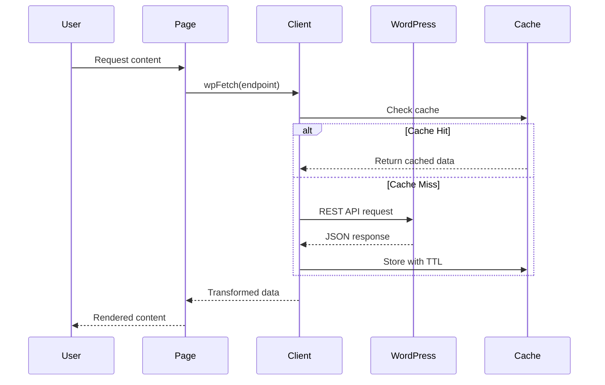

# Design Document - WordPress SCF Extension

## Overview

This design document outlines the architecture for extending the Zawaya platform's WordPress integration with comprehensive Smart Custom Field (SCF) mappings, new Custom Post Types support, and enhanced media functionality. The extension builds upon the existing WordPress REST API client and SCF mapping system to support programs, episodes, and Taqdeer content types with a global media player system.

## Architecture

### High-Level Architecture

```mermaid
graph TB
    WP[WordPress Backend] --> API[WordPress REST API]
    API --> Client[WordPress Client]
    Client --> SCF[SCF Mappings Layer]
    SCF --> Components[React Components]
    Components --> Pages[Next.js Pages]
    
    subgraph "SCF Mappings"
        PostMap[Post Mappings]
        ProgramMap[Program Mappings] 
        EpisodeMap[Episode Mappings]
        TaqdeerMap[Taqdeer Mappings]
    end
    
    subgraph "Media System"
        Context[Media Context]
        Player[Sticky Player]
        Components --> Context
        Context --> Player
    end
    
    subgraph "Routes"
        ProgramsIndex[/programs]
        ProgramDetail[/programs/[slug]]
        EpisodeDetail[/episodes/[slug]]
        TaqdeerDetail[/taqdeer-mawqef/[slug]]
    end
```

### Data Flow Architecture



## Components and Interfaces

### 1. Extended SCF Type Mappings

#### 1.1 Post Mappings Extension
**File**: `lib/scf-mappings/post.ts`

```typescript
export interface PostMeta extends ExistingPostMeta {
  reading_time: number
  inline_media: MediaItem[]
  meta_description: string
  meta_og_image: string
}

interface MediaItem {
  type: 'image' | 'video' | 'audio'
  url: string
  caption?: string
  alt?: string
}
```

#### 1.2 Program Mappings Extension
**File**: `lib/scf-mappings/program.ts`

```typescript
export interface ProgramMeta extends ExistingProgramMeta {
  trailer_video_url: string
  apple_link: string
  spotify_link: string
  google_link: string
  rss_feed: string
}
```

#### 1.3 Episode Mappings Extension
**File**: `lib/scf-mappings/episode.ts`

```typescript
export interface EpisodeMeta {
  season_number: number
  episode_number: number
  transcript_markdown: string
  resource_links: ResourceLink[]
  key_points: string[]
  chapters: Chapter[]
}

interface Chapter {
  start: number // seconds
  title: string
}

interface ResourceLink {
  title: string
  url: string
  type: 'article' | 'website' | 'document'
}
```

#### 1.4 Taqdeer Mappings
**File**: `lib/scf-mappings/taqdeer.ts`

```typescript
export interface TaqdeerMeta {
  kicker: string
  deck: string
  verdict: 'positive' | 'negative' | 'neutral'
  verdict_confidence: number
  charts_gallery: ChartItem[]
  key_findings: string[]
  methodology: string
  sources: Source[]
}

interface ChartItem {
  title: string
  image_url: string
  description?: string
}

interface Source {
  title: string
  url?: string
  date?: string
  type: 'report' | 'article' | 'interview' | 'data'
}
```

#### 1.5 Central Index Export
**File**: `lib/scf-mappings/index.ts`

```typescript
// Re-export all mapping interfaces and functions
export * from './article-mappings'
export * from './program-mappings'
export * from './author-mappings'
export * from './post'
export * from './program'
export * from './episode'
export * from './taqdeer'
```

### 2. WordPress REST API Client Extension

#### 2.1 Generic wpFetch Function
**File**: `lib/wp.ts`

```typescript
export async function wpFetch<T>(
  endpoint: string, 
  queryString: string = ''
): Promise<T> {
  const url = `${WP_API_URL}/wp-json/wp/v2${endpoint}${queryString}`
  
  const response = await fetch(url, {
    headers: {
      'Authorization': `Basic ${authToken}`,
      'Content-Type': 'application/json'
    },
    next: { revalidate: 60 } // ISR cache
  })
  
  if (!response.ok) {
    throw new WordPressError(`HTTP ${response.status}`, response.status)
  }
  
  return response.json()
}
```

#### 2.2 Content Fetcher Functions

```typescript
export async function getPrograms(): Promise<ProgramData[]> {
  return wpFetch<ProgramData[]>('/programs', '?_embed&_fields=id,slug,title,content,excerpt,meta')
}

export async function getProgram(slug: string): Promise<ProgramData | null> {
  const programs = await wpFetch<ProgramData[]>('/programs', `?slug=${slug}&_embed&_fields=id,slug,title,content,excerpt,meta`)
  return programs[0] || null
}

export async function getEpisodesByProgram(parentId: number): Promise<EpisodeData[]> {
  return wpFetch<EpisodeData[]>('/episodes', `?parent=${parentId}&_embed&_fields=id,slug,title,content,excerpt,meta`)
}

export async function getEpisode(slug: string): Promise<EpisodeData | null> {
  const episodes = await wpFetch<EpisodeData[]>('/episodes', `?slug=${slug}&_embed&_fields=id,slug,title,content,excerpt,meta`)
  return episodes[0] || null
}

export async function getTaqdeer(slug: string): Promise<TaqdeerData | null> {
  const items = await wpFetch<TaqdeerData[]>('/taqdeer_mawqef', `?slug=${slug}&_embed&_fields=id,slug,title,content,excerpt,meta`)
  return items[0] || null
}
```

### 3. Global Media Player System

#### 3.1 Media Context
**File**: `src/context/StickyMediaContext.tsx`

```typescript
interface MediaState {
  url: string
  type: 'audio' | 'video'
  poster?: string
  title?: string
  isPlaying: boolean
}

interface MediaContextType {
  media: MediaState | null
  setMedia: (media: MediaState | null) => void
  play: () => void
  pause: () => void
  toggle: () => void
}

export const StickyMediaContext = createContext<MediaContextType | null>(null)
```

#### 3.2 Sticky Media Player Component
**File**: `src/components/StickyMediaPlayer.tsx`

```typescript
export function StickyMediaPlayer() {
  const { media, play, pause, toggle } = useStickyMedia()
  
  if (!media) return null
  
  return (
    <div className="fixed bottom-0 left-0 right-0 bg-white border-t shadow-lg z-50">
      <div className="flex items-center p-4">
        {media.type === 'video' ? (
          <video src={media.url} poster={media.poster} controls className="w-full max-w-sm" />
        ) : (
          <audio src={media.url} controls className="flex-1" />
        )}
        <button onClick={toggle} className="ml-4">
          {media.isPlaying ? <PauseIcon /> : <PlayIcon />}
        </button>
      </div>
    </div>
  )
}
```

### 4. Content Display Components

#### 4.1 Program Hero Component
**File**: `components/ProgramHero.tsx`

```typescript
interface ProgramHeroProps {
  program: WPProgram
}

export function ProgramHero({ program }: ProgramHeroProps) {
  const { setMedia } = useStickyMedia()
  
  const handleTrailerPlay = () => {
    if (program.meta.trailer_video_url) {
      setMedia({
        url: program.meta.trailer_video_url,
        type: 'video',
        poster: program.meta.cover_image,
        title: program.title.rendered
      })
    }
  }
  
  return (
    <div className="relative">
      
      <div className="absolute inset-0 bg-gradient-to-t from-black/60">
        <div className="absolute bottom-0 p-6 text-white">
          <h1>{program.title.rendered}</h1>
          <p>{program.meta.host_arabic}</p>
          
          <div className="flex gap-4 mt-4">
            {program.meta.apple_link && (
              <a href={program.meta.apple_link} className="btn-subscribe">
                Apple Podcasts
              </a>
            )}
            {program.meta.spotify_link && (
              <a href={program.meta.spotify_link} className="btn-subscribe">
                Spotify
              </a>
            )}
            {program.meta.google_link && (
              <a href={program.meta.google_link} className="btn-subscribe">
                Google Podcasts
              </a>
            )}
          </div>
        </div>
      </div>
    </div>
  )
}
```

#### 4.2 Episode Player Component
**File**: `components/EpisodePlayer.tsx`

```typescript
interface EpisodePlayerProps {
  episode: WPEpisode
}

export function EpisodePlayer({ episode }: EpisodePlayerProps) {
  const { setMedia } = useStickyMedia()
  
  const handlePlay = () => {
    const mediaUrl = episode.meta.video_embed_url || episode.meta.audio_file_url
    if (mediaUrl) {
      setMedia({
        url: mediaUrl,
        type: episode.meta.video_embed_url ? 'video' : 'audio',
        poster: episode.meta.episode_poster,
        title: episode.title.rendered
      })
    }
  }
  
  return (
    <div className="episode-player">
      {episode.meta.video_embed_url ? (
        <ReactPlayer 
          url={episode.meta.video_embed_url}
          controls
          onPlay={handlePlay}
        />
      ) : (
        <audio 
          src={episode.meta.audio_file_url}
          controls
          onPlay={handlePlay}
        />
      )}
    </div>
  )
}
```

#### 4.3 Chapters List Component
**File**: `components/ChaptersList.tsx`

```typescript
interface ChaptersListProps {
  chapters: Chapter[]
  onSeek: (time: number) => void
}

export function ChaptersList({ chapters, onSeek }: ChaptersListProps) {
  return (
    <div className="chapters-list">
      <h3>فصول الحلقة</h3>
      <ul>
        {chapters.map((chapter, index) => (
          <li key={index} className="chapter-item">
            <button 
              onClick={() => onSeek(chapter.start)}
              className="flex items-center gap-3 w-full text-right p-3 hover:bg-gray-50"
            >
              <span className="text-sm text-gray-500">
                {formatTime(chapter.start)}
              </span>
              <span>{chapter.title}</span>
            </button>
          </li>
        ))}
      </ul>
    </div>
  )
}
```

#### 4.4 Transcript Accordion Component
**File**: `components/TranscriptAccordion.tsx`

```typescript
interface TranscriptAccordionProps {
  markdown: string
}

export function TranscriptAccordion({ markdown }: TranscriptAccordionProps) {
  const [isOpen, setIsOpen] = useState(false)
  
  return (
    <div className="transcript-accordion">
      <button 
        onClick={() => setIsOpen(!isOpen)}
        className="flex items-center justify-between w-full p-4 bg-gray-50"
      >
        <span>نص الحلقة</span>
        <ChevronDownIcon className={`transform ${isOpen ? 'rotate-180' : ''}`} />
      </button>
      
      {isOpen && (
        <div className="p-4 prose prose-arabic max-w-none">
          <ReactMarkdown>{markdown}</ReactMarkdown>
        </div>
      )}
    </div>
  )
}
```

#### 4.5 Longform Layout Component
**File**: `components/LongformLayout.tsx`

```typescript
interface LongformLayoutProps {
  taqdeer: WPTaqdeer
}

export function LongformLayout({ taqdeer }: LongformLayoutProps) {
  const verdictColor = {
    positive: 'text-green-600',
    negative: 'text-red-600', 
    neutral: 'text-gray-600'
  }[taqdeer.meta.verdict]
  
  return (
    <article className="longform-layout max-w-4xl mx-auto">
      <header className="mb-8">
        <div className="text-sm text-gray-500 mb-2">{taqdeer.meta.kicker}</div>
        <h1 className="text-4xl font-bold mb-4">{taqdeer.title.rendered}</h1>
        <p className="text-xl text-gray-600 mb-4">{taqdeer.meta.deck}</p>
        
        <div className={`inline-flex items-center px-3 py-1 rounded-full text-sm font-medium ${verdictColor} bg-opacity-10`}>
          <span>التقدير: {taqdeer.meta.verdict}</span>
          <span className="mr-2">({taqdeer.meta.verdict_confidence}%)</span>
        </div>
      </header>
      
      <div className="prose prose-arabic max-w-none mb-8">
        <div dangerouslySetInnerHTML={{ __html: taqdeer.content.rendered }} />
      </div>
      
      {taqdeer.meta.charts_gallery && (
        <div className="charts-gallery mb-8">
          <h3>الرسوم البيانية</h3>
          <div className="grid grid-cols-1 md:grid-cols-2 gap-6">
            {taqdeer.meta.charts_gallery.map((chart, index) => (
              <div key={index} className="chart-item">
                
                <h4>{chart.title}</h4>
                {chart.description && <p>{chart.description}</p>}
              </div>
            ))}
          </div>
        </div>
      )}
    </article>
  )
}
```

## Data Models

### WordPress Custom Post Types

#### Program CPT
```php
// WordPress CPT registration
register_post_type('programs', [
    'public' => true,
    'show_in_rest' => true,
    'rest_base' => 'programs',
    'supports' => ['title', 'editor', 'excerpt', 'thumbnail', 'custom-fields']
]);
```

#### Episode CPT
```php
register_post_type('episodes', [
    'public' => true,
    'show_in_rest' => true,
    'rest_base' => 'episodes',
    'supports' => ['title', 'editor', 'excerpt', 'thumbnail', 'custom-fields'],
    'hierarchical' => true // For program relationships
]);
```

#### Taqdeer CPT
```php
register_post_type('taqdeer_mawqef', [
    'public' => true,
    'show_in_rest' => true,
    'rest_base' => 'taqdeer_mawqef',
    'supports' => ['title', 'editor', 'excerpt', 'thumbnail', 'custom-fields']
]);
```

### TypeScript Data Models

```typescript
// Unified content interface
interface ContentItem {
  id: number
  slug: string
  title: string
  content: string
  excerpt: string
  type: 'post' | 'program' | 'episode' | 'taqdeer'
  meta: Record<string, any>
  featured_image?: string
  date: string
  modified: string
}

// Extended interfaces for specific types
interface ProgramData extends ContentItem {
  type: 'program'
  meta: ProgramMeta
}

interface EpisodeData extends ContentItem {
  type: 'episode'
  meta: EpisodeMeta
  parent?: number // Program ID
}

interface TaqdeerData extends ContentItem {
  type: 'taqdeer'
  meta: TaqdeerMeta
}
```

## Error Handling

### WordPress API Error Handling

```typescript
class WordPressError extends Error {
  constructor(
    message: string,
    public statusCode: number,
    public endpoint: string
  ) {
    super(message)
    this.name = 'WordPressError'
  }
}

export async function wpFetch<T>(endpoint: string, qs = ''): Promise<T> {
  try {
    const response = await fetch(url, options)
    
    if (!response.ok) {
      throw new WordPressError(
        `WordPress API error: ${response.statusText}`,
        response.status,
        endpoint
      )
    }
    
    return await response.json()
  } catch (error) {
    if (error instanceof WordPressError) {
      throw error
    }
    
    // Network or parsing errors
    throw new WordPressError(
      `Network error: ${error.message}`,
      0,
      endpoint
    )
  }
}
```

### Component Error Boundaries

```typescript
export function MediaPlayerErrorBoundary({ children }: { children: React.ReactNode }) {
  return (
    <ErrorBoundary
      fallback={<div className="p-4 text-center text-gray-500">خطأ في تشغيل الوسائط</div>}
      onError={(error) => console.error('Media player error:', error)}
    >
      {children}
    </ErrorBoundary>
  )
}
```

## Testing Strategy

### Unit Tests
- SCF mapping transformation functions
- WordPress API client methods
- Media context state management
- Component prop validation

### Integration Tests
- WordPress API endpoint responses
- Cache revalidation workflows
- Media player functionality
- Route generation and navigation

### End-to-End Tests
- Complete user journeys through programs and episodes
- Media playback across page navigation
- Cache invalidation after content updates
- RTL layout and Arabic typography

### Performance Tests
- Page load times with ISR
- Media streaming performance
- Cache hit rates
- Bundle size impact

## Cache Strategy

### ISR Configuration
```typescript
// Page-level ISR
export const revalidate = 300 // 5 minutes

// API-level caching
const cacheConfig = {
  programs: { revalidate: 300, tags: ['programs'] },
  episodes: { revalidate: 180, tags: ['episodes'] },
  taqdeer: { revalidate: 600, tags: ['taqdeer'] }
}
```

### Cache Tags Strategy
```typescript
// Hierarchical cache tags
const generateCacheTags = (content: ContentItem) => {
  const baseTags = [content.type, `${content.type}:${content.id}`]
  
  if (content.type === 'episode' && content.parent) {
    baseTags.push(`program:${content.parent}`)
  }
  
  return baseTags
}
```

## Security Considerations

### API Authentication
- WordPress Application Passwords for REST API access
- Environment variable protection for credentials
- Rate limiting on API endpoints

### Content Validation
- Input sanitization for user-generated content
- XSS protection in markdown rendering
- URL validation for media sources

### Cache Security
- Secure cache key generation
- Protected revalidation endpoints
- CORS configuration for media resources

## Performance Optimizations

### Static Generation
- Pre-generate popular program and episode pages
- Incremental Static Regeneration for content updates
- Optimized image loading with Next.js Image

### Media Optimization
- Lazy loading for video content
- Progressive audio loading
- CDN integration for media assets

### Bundle Optimization
- Code splitting for media components
- Dynamic imports for heavy dependencies
- Tree shaking for unused SCF mappings

## Deployment Strategy

### Environment Configuration
```bash
# Production environment variables
WP_API_URL=https://wordpress-1401009-5702602.cloudwaysapps.com
WP_USERNAME=Zawayawp
WP_APP_PASSWORD=lDLhSBco7QgR3IDuOZQzoY6k
REVALIDATION_SECRET=supersecret
```

### Build Process
1. TypeScript compilation with strict null checks
2. ESLint validation with custom rules
3. Bundle analysis and optimization
4. Cache warming for critical paths

### Monitoring
- WordPress API health checks
- Media playback error tracking
- Cache hit rate monitoring
- Performance metrics collection