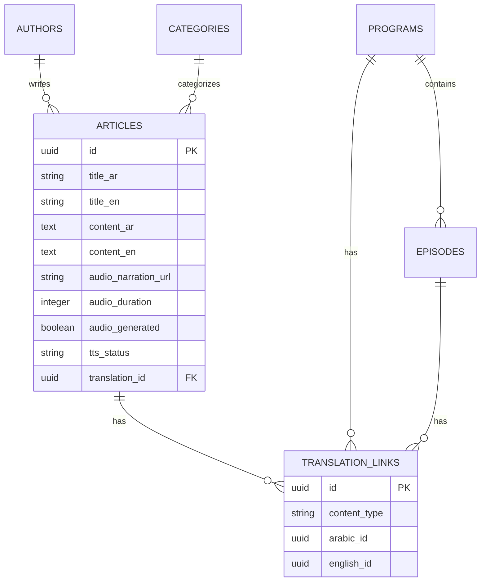

# Design Document - Zawaya Platform Transformation (Phase 1)

## Overview

This design document outlines the technical architecture and implementation approach for transforming the existing Zawaya platform into an Arabic-first intellectual publishing platform. The design leverages the current solid foundation (Next.js 15.2.4 + Supabase + comprehensive admin system) while implementing enhanced content modeling, audio narration features, and optimized Arabic user experience.

## Architecture

### Current Architecture Analysis

The existing system provides an excellent foundation with:
- **Frontend**: Next.js 15.2.4 with App Router, React 19, TypeScript
- **Styling**: TailwindCSS with proper Zawaya brand colors and RTL support
- **UI Components**: Radix UI for accessibility
- **Backend**: Supabase PostgreSQL with comprehensive schema
- **Admin System**: Full-featured CMS with rich text editing, media management, user roles
- **Database**: Well-structured multilingual content model

### Enhanced Architecture Design

```mermaid
graph TB
    A[Root /] --> B[Redirect to /ar]
    B --> C[Arabic Site /ar/]
    
    C --> D[Arabic Content Pages]
    D --> E[Supabase Database]
    
    E --> F[Content Management]
    E --> G[Media Storage]
    E --> H[Audio Narration]
    
    F --> I[Admin Panel]
    G --> I
    H --> I
    
    I --> J[Rich Text Editor]
    I --> K[Media Manager]
    I --> L[User Management]
    
    M[External Services] --> N[Email Service]
    M --> O[Text-to-Speech]
    M --> P[CDN/Storage]
```

### Key Architectural Decisions

1. **Arabic-First Approach**: Direct routing to Arabic content without language selection complexity
2. **Simplified Routing**: Clean `/ar/*` structure without i18n overhead
3. **Enhanced Content Model**: Focus on Arabic content with audio narration support
4. **Performance-First**: Implement ISR and proper caching strategies for Arabic content
5. **SEO Optimization**: Server-side rendering with Arabic-optimized meta tags and structured data

## Components and Interfaces

### 1. Routing Layer

#### Direct Arabic Routing
```typescript
// Simplified routing without i18n complexity
// Root redirect to Arabic
export default function HomePage() {
  redirect('/ar')
}

// Clean Arabic routes
/ar → Arabic Homepage
/ar/articles → Arabic Articles
/ar/podcast → Arabic Podcasts
/ar/programs → Arabic Programs
```

#### Content Management Interface
```typescript
interface ArabicContent {
  id: string
  title_ar: string
  content_ar: string
  category_ar: string
  author_ar: string
  audio_narration_url?: string
  created_at: string
  updated_at: string
}

interface ContentService {
  getContent(contentId: string): Promise<ArabicContent | null>
  createContent(content: Partial<ArabicContent>): Promise<string>
  updateContent(contentId: string, updates: Partial<ArabicContent>): Promise<void>
}
```

### 2. Enhanced Content Management

#### Audio Narration Integration
```typescript
interface ArticleWithAudio extends Article {
  audio_narration_url?: string
  audio_duration?: number
  audio_generated?: boolean
  tts_status?: 'pending' | 'processing' | 'completed' | 'failed'
}

interface AudioService {
  generateNarration(articleId: string, text: string): Promise<string>
  uploadAudioFile(file: File, articleId: string): Promise<string>
  getAudioMetadata(url: string): Promise<{ duration: number; size: number }>
}
```

#### Program and Episode Enhancement
```typescript
interface EnhancedProgram {
  id: string
  title_ar: string
  title_en?: string
  description_ar: string
  description_en?: string
  format: 'video' | 'audio' | 'both'
  host_name?: string
  schedule?: string
  cover_image_url: string
  episodes: Episode[]
  translation_id?: string
}

interface EnhancedEpisode {
  id: string
  program_id: string
  title_ar: string
  title_en?: string
  episode_number?: number
  season_number?: number
  video_url?: string
  audio_url?: string
  duration?: number
  guest_name?: string
  show_notes?: string
  transcript?: string
  translation_id?: string
}
```

### 3. Navigation and User Experience

#### Enhanced Navigation Component
```typescript
interface NavigationStructure {
  home: NavigationItem
  written_content: {
    all_articles: NavigationItem
    opinions: NavigationItem
    assessments: NavigationItem
    culture: NavigationItem
  }
  audio_content: {
    all_podcasts: NavigationItem
    programs: NavigationItem[]
  }
  video_content: {
    all_programs: NavigationItem
    documentaries: NavigationItem
    featured: NavigationItem[]
  }
  platform: {
    about: NavigationItem
    writers_forum: NavigationItem
    contact: NavigationItem
    search: NavigationItem
  }
}
```

#### Language Switching Logic
```typescript
interface LanguageSwitcher {
  getCurrentLocale(): string
  getAlternateUrl(currentPath: string, targetLocale: string): Promise<string>
  hasTranslation(contentId: string, targetLocale: string): Promise<boolean>
  switchLanguage(targetLocale: string, currentPath: string): Promise<void>
}
```

### 4. Search and Discovery

#### Enhanced Search Interface
```typescript
interface SearchService {
  searchContent(query: string, locale: string, filters?: SearchFilters): Promise<SearchResult[]>
  getRelatedContent(contentId: string, contentType: string): Promise<ContentItem[]>
  getFeaturedContent(locale: string): Promise<ContentItem[]>
  getAuthorContent(authorId: string): Promise<ContentItem[]>
}

interface SearchFilters {
  content_type?: 'article' | 'program' | 'episode'
  category?: string
  author?: string
  date_range?: { start: Date; end: Date }
  has_audio?: boolean
}
```

## Data Models

### Enhanced Database Schema

#### Translation Links Table
```sql
CREATE TABLE translation_links (
    id UUID DEFAULT gen_random_uuid() PRIMARY KEY,
    content_type VARCHAR(50) NOT NULL,
    arabic_id UUID NOT NULL,
    english_id UUID NOT NULL,
    created_at TIMESTAMP WITH TIME ZONE DEFAULT NOW(),
    updated_at TIMESTAMP WITH TIME ZONE DEFAULT NOW(),
    UNIQUE(content_type, arabic_id),
    UNIQUE(content_type, english_id)
);
```

#### Enhanced Articles Table
```sql
ALTER TABLE articles ADD COLUMN IF NOT EXISTS audio_narration_url VARCHAR(500);
ALTER TABLE articles ADD COLUMN IF NOT EXISTS audio_duration INTEGER;
ALTER TABLE articles ADD COLUMN IF NOT EXISTS audio_generated BOOLEAN DEFAULT false;
ALTER TABLE articles ADD COLUMN IF NOT EXISTS tts_status VARCHAR(20) DEFAULT 'pending';
ALTER TABLE articles ADD COLUMN IF NOT EXISTS translation_id UUID REFERENCES translation_links(id);
```

#### Enhanced Programs Table
```sql
ALTER TABLE programs ADD COLUMN IF NOT EXISTS format VARCHAR(20) DEFAULT 'video';
ALTER TABLE programs ADD COLUMN IF NOT EXISTS host_name VARCHAR(200);
ALTER TABLE programs ADD COLUMN IF NOT EXISTS schedule VARCHAR(100);
ALTER TABLE programs ADD COLUMN IF NOT EXISTS translation_id UUID REFERENCES translation_links(id);
```

### Content Relationship Model



## Error Handling

### Translation Error Handling
```typescript
class TranslationError extends Error {
  constructor(
    message: string,
    public contentId: string,
    public targetLocale: string,
    public errorType: 'not_found' | 'link_broken' | 'access_denied'
  ) {
    super(message)
  }
}

interface ErrorHandlingStrategy {
  handleMissingTranslation(contentId: string, targetLocale: string): Promise<string>
  handleBrokenTranslationLink(linkId: string): Promise<void>
  logTranslationError(error: TranslationError): Promise<void>
}
```

### Audio Processing Error Handling
```typescript
interface AudioErrorHandler {
  handleTTSFailure(articleId: string, error: Error): Promise<void>
  handleAudioUploadFailure(file: File, error: Error): Promise<void>
  retryAudioGeneration(articleId: string): Promise<void>
}
```

## Testing Strategy

### Unit Testing
- **Translation Services**: Test language switching, content linking, fallback mechanisms
- **Audio Services**: Test TTS integration, file uploads, metadata extraction
- **Search Services**: Test multilingual search, filtering, result ranking
- **Navigation Components**: Test locale-aware routing, menu generation

### Integration Testing
- **i18n Routing**: Test locale detection, URL generation, content serving
- **Database Operations**: Test translation linking, content queries, data consistency
- **External Services**: Test email service integration, TTS service calls
- **Admin Panel**: Test content creation, translation management, media uploads

### End-to-End Testing
- **User Journeys**: Test complete user flows from language selection to content consumption
- **Editorial Workflows**: Test content creation, translation linking, publishing processes
- **Performance Testing**: Test page load times, search response times, media streaming
- **Accessibility Testing**: Test screen reader compatibility, keyboard navigation, color contrast

### Testing Implementation
```typescript
// Example test structure
describe('Translation Service', () => {
  test('should link Arabic and English articles', async () => {
    const arabicArticle = await createTestArticle('ar')
    const englishArticle = await createTestArticle('en')
    
    await translationService.linkTranslations(
      arabicArticle.id, 
      englishArticle.id, 
      'article'
    )
    
    const translation = await translationService.getTranslation(
      arabicArticle.id, 
      'en'
    )
    
    expect(translation).toBe(englishArticle.id)
  })
})
```

## Performance Considerations

### Caching Strategy
- **Static Generation**: Pre-generate all article and program pages
- **Incremental Regeneration**: Update content pages on publish/edit
- **API Caching**: Cache search results and content lists
- **CDN Integration**: Serve media files through global CDN

### Database Optimization
- **Indexing**: Add indexes for translation lookups, search queries
- **Query Optimization**: Use efficient joins for multilingual content
- **Connection Pooling**: Optimize database connection management
- **Read Replicas**: Consider read replicas for high-traffic scenarios

### Bundle Optimization
- **Code Splitting**: Split by locale and content type
- **Dynamic Imports**: Load translation files on demand
- **Image Optimization**: Use Next.js Image with proper sizing
- **Font Loading**: Optimize Arabic and English font loading

This design provides a comprehensive foundation for implementing the Zawaya platform transformation while leveraging the existing solid architecture and adding the specified enhancements for internationalization, content management, and user experience.