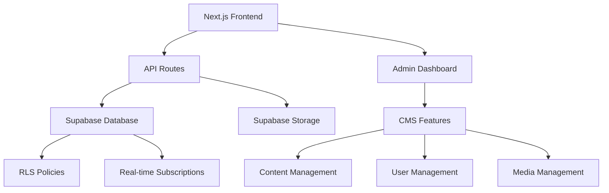

# 🌟 Zawaya Platform - Arabic Intellectual Hub

<div align="center">


**A comprehensive bilingual content management platform for Arabic intellectual discourse**

[](https://www.typescriptlang.org/)
[](https://nextjs.org/)
[](https://supabase.com/)
[](https://tailwindcss.com/)

[🚀 Live Demo](https://zawayaa.vercel.app/) | [📖 Documentation](#documentation) | [🛠️ Setup Guide](#setup) | [📊 Admin Panel](#admin-features)

</div>

## 📋 Table of Contents

- [🌟 Features](#features)
- [🏗️ Architecture](#architecture)
- [🚀 Quick Start](#quick-start)
- [📖 Documentation](#documentation)
- [🛠️ Admin Features](#admin-features)
- [🔧 Development](#development)
- [📚 API Documentation](#api-documentation)
- [🚨 Troubleshooting](#troubleshooting)
- [🤝 Contributing](#contributing)

## 🌟 Features

### 🎯 **Core Platform Features**
- **📱 Bilingual Support** - Arabic (RTL) and English (LTR) content
- **📝 Rich Text Editor** - Advanced content creation with media support
- **🎙️ Multimedia Content** - Podcasts, videos, and documentaries
- **📧 Newsletter System** - Automated email campaigns
- **🔍 Advanced Search** - Full-text search across all content
- **📊 Analytics Dashboard** - Real-time performance metrics
- **👥 User Management** - Role-based access control

### 🎨 **Design & UX**
- **🌙 Modern Design** - Clean, professional interface
- **📱 Responsive Layout** - Optimized for all devices
- **♿ Accessibility** - WCAG AA compliant
- **🎨 Brand Consistency** - Comprehensive design system
- **⚡ Performance** - Optimized loading and navigation

### 🛠️ **CMS Features**
- **📰 Article Management** - Create, edit, and publish articles
- **🎥 Media Library** - Centralized file management
- **📅 Content Scheduler** - Automated publishing system
- **👤 Author Profiles** - Comprehensive writer management
- **🏷️ Category System** - Organized content classification
- **📊 Analytics** - Detailed performance tracking

## 🏗️ Architecture



### **Tech Stack**

| Component | Technology | Purpose |
|-----------|------------|---------|
| **Frontend** | Next.js 14 + TypeScript | React framework with SSR/SSG |
| **Styling** | Tailwind CSS + shadcn/ui | Utility-first CSS + components |
| **Database** | Supabase PostgreSQL | Real-time database with auth |
| **Storage** | Supabase Storage | File and media management |
| **Authentication** | Supabase Auth | User authentication & authorization |
| **Deployment** | Vercel | Production hosting platform |

## 🚀 Quick Start

### **Prerequisites**
- Node.js 18+ 
- npm/yarn/pnpm
- Supabase account

### **1. Clone Repository**
```bash
git clone https://github.com/gmdgdn/zawayaa.git
cd zawayaa
```

### **2. Install Dependencies**
```bash
npm install
# or
yarn install
# or
pnpm install
```

### **3. Environment Setup**
Create `.env.local`:
```bash
# Supabase Configuration
NEXT_PUBLIC_SUPABASE_URL=your_supabase_url
NEXT_PUBLIC_SUPABASE_ANON_KEY=your_supabase_anon_key
SUPABASE_SERVICE_ROLE_KEY=your_service_role_key

# Optional: TTS Service
PLAYHT_API_KEY=your_playht_api_key
PLAYHT_USER_ID=your_playht_user_id
```

### **4. Database Setup**
```bash
# Run setup script
node scripts/setup-supabase.js

# Or manually run SQL files in Supabase dashboard:
# 1. scripts/create-database-schema.sql
# 2. scripts/seed-categories.sql
# 3. scripts/seed-sample-data.sql
```

### **5. Start Development**
```bash
npm run dev
```

Visit [http://localhost:3000](http://localhost:3000) to see the platform.

## 📖 Documentation

### **Setup Guides**
- 📋 [**Complete Setup Guide**](ENVIRONMENT_SETUP.md) - Step-by-step configuration
- 🗄️ [**Database Setup**](DATABASE_SETUP.md) - Supabase configuration
- 🔧 [**Admin Setup**](ADMIN_SETUP.md) - Admin panel configuration
- 🎨 [**Rich Editor Guide**](RICH_EDITOR_GUIDE.md) - Content creation guide

### **Architecture Docs**
- 🏗️ [**System Architecture**](docs/ARCHITECTURE.md) - Technical overview
- 🔌 [**API Documentation**](docs/API.md) - Endpoint reference
- 🎨 [**Design System**](docs/DESIGN_SYSTEM.md) - UI/UX guidelines
- 📱 [**Component Library**](docs/COMPONENTS.md) - React components

### **User Guides**
- ✍️ [**Content Creation**](docs/CONTENT_CREATION.md) - Writing and publishing
- 👥 [**User Management**](docs/USER_MANAGEMENT.md) - Roles and permissions
- 📊 [**Analytics Guide**](docs/ANALYTICS.md) - Understanding metrics
- 🔧 [**Admin Guide**](docs/ADMIN_GUIDE.md) - Platform administration

## 🛠️ Admin Features

### **🏠 Dashboard Overview**
- **📊 Real-time Analytics** - Views, subscribers, engagement
- **📈 Performance Metrics** - Content performance tracking
- **🚨 System Health** - Database and service monitoring
- **📅 Recent Activity** - Latest content and user actions

### **📰 Content Management**
- **📝 Article Editor** - Rich text editor with media support
- **🎥 Media Library** - File upload and organization
- **📅 Publishing Scheduler** - Automated content publishing
- **🏷️ Category Management** - Content organization system
- **🔍 Content Search** - Advanced filtering and search

### **👥 User Administration**
- **👤 User Profiles** - Comprehensive user management
- **🔐 Role Assignment** - Granular permission control
- **📊 User Analytics** - Activity and engagement tracking
- **✉️ Communication** - User messaging and notifications

### **📊 Analytics & Reporting**
- **📈 Content Performance** - Views, shares, engagement
- **👥 Audience Insights** - User demographics and behavior
- **📧 Newsletter Analytics** - Subscription and campaign metrics
- **🔍 Search Analytics** - Popular searches and trends

### **⚙️ System Management**
- **🔧 Platform Settings** - Configuration and preferences
- **🗄️ Database Health** - Connection and performance monitoring
- **🔒 Security Settings** - Access control and permissions
- **📋 Audit Logs** - System activity tracking

## 🔧 Development

### **Project Structure**
```
zawayaa/
├── app/                    # Next.js app directory
│   ├── admin/             # Admin panel pages
│   ├── api/               # API routes
│   ├── ar/                # Arabic content pages
│   └── [locale]/          # Internationalized routes
├── components/            # React components
│   ├── admin/            # Admin-specific components
│   ├── editor/           # Rich text editor components
│   └── ui/               # UI component library
├── lib/                   # Utility libraries
│   ├── database.ts       # Database service layer
│   ├── supabase.ts       # Supabase client
│   └── types.ts          # TypeScript definitions
├── scripts/              # Database and setup scripts
├── public/               # Static assets
└── docs/                 # Documentation
```

### **Development Commands**
```bash
# Development server
npm run dev

# Type checking
npm run type-check

# Linting
npm run lint

# Production build
npm run build

# Start production server
npm start

# Database migrations
npm run db:migrate

# Database reset
npm run db:reset
```

### **Environment Variables**
```bash
# Required
NEXT_PUBLIC_SUPABASE_URL=          # Supabase project URL
NEXT_PUBLIC_SUPABASE_ANON_KEY=     # Supabase anonymous key
SUPABASE_SERVICE_ROLE_KEY=         # Supabase service role key

# Optional
PLAYHT_API_KEY=                    # PlayHT TTS API key
PLAYHT_USER_ID=                    # PlayHT user ID
NEXT_PUBLIC_GOOGLE_ANALYTICS_ID=   # Google Analytics ID
RESEND_API_KEY=                    # Email service API key
```

## 📚 API Documentation

### **Core Endpoints**

| Endpoint | Method | Description |
|----------|--------|-------------|
| `/api/articles` | GET, POST | Article management |
| `/api/articles/[id]` | GET, PUT, DELETE | Individual articles |
| `/api/search` | GET | Content search |
| `/api/newsletter` | POST | Newsletter subscription |
| `/api/submit-article` | POST | Guest article submission |
| `/api/homepage` | GET | Homepage content |
| `/api/test-supabase` | GET | Database health check |

### **Authentication**
- **JWT Tokens** - Supabase Auth integration
- **Role-based Access** - Admin, Editor, Writer, Contributor
- **Row Level Security** - Database-level permissions

### **Response Format**
```json
{
  "success": true,
  "data": { ... },
  "message": "Success message",
  "pagination": {
    "page": 1,
    "limit": 10,
    "total": 100
  }
}
```

## 🚨 Troubleshooting

### **Common Issues**

**🔌 Database Connection Failed**
```bash
# Check environment variables
npm run test-db

# Verify Supabase project status
# Run diagnostic: http://localhost:3000/api/test-supabase
```

**🚫 404 Errors on Pages**
```bash
# Missing route files - check app/ directory structure
# Run navigation test
npm run test-routes
```

**🖼️ Missing Images (404)**
```bash
# Copy placeholder images
npm run copy-placeholders

# Or manually:
cp public/placeholder.jpg public/images/episodes/
```

**⚠️ Next.js Metadata Warnings**
- Solution: Move viewport config to `viewport.ts` export
- Check: Latest Next.js documentation for metadata API

**🔐 Admin Access Denied**
```sql
-- Check user role in database
SELECT id, email, role FROM authors WHERE email = 'your@email.com';

-- Update user role
UPDATE authors SET role = 'admin' WHERE email = 'your@email.com';
```

### **Development Issues**

**🚀 Build Errors**
```bash
# Clear Next.js cache
rm -rf .next

# Reinstall dependencies
rm -rf node_modules package-lock.json
npm install
```

**💾 Database Schema Issues**
```bash
# Run setup script
node scripts/setup-supabase.js

# Check database health
curl http://localhost:3000/api/test-supabase
```

## 🤝 Contributing

### **Development Workflow**
1. **Fork** the repository
2. **Clone** your fork locally
3. **Create** a feature branch
4. **Make** your changes
5. **Test** thoroughly
6. **Submit** a pull request

### **Code Standards**
- **TypeScript** - Strict type checking
- **ESLint** - Code linting and formatting
- **Prettier** - Code formatting
- **Conventional Commits** - Commit message format

### **Testing**
```bash
# Run all tests
npm test

# Type checking
npm run type-check

# Linting
npm run lint:fix
```

## 📞 Support

### **Resources**
- 📖 [Documentation](docs/)
- 🐛 [Issue Tracker](https://github.com/gmdgdn/zawayaa/issues)
- 💬 [Discussions](https://github.com/gmdgdn/zawayaa/discussions)
- 📧 [Email Support](mailto:support@zawaya.com)

### **Links**
- 🌐 [Live Platform](https://zawayaa.vercel.app/)
- 📊 [Admin Dashboard](https://zawayaa.vercel.app/admin)
- 🔧 [Setup Guide](ENVIRONMENT_SETUP.md)
- 📚 [API Docs](docs/API.md)

---

<div align="center">

**Built with ❤️ for Arabic intellectual discourse**

[⭐ Star on GitHub](https://github.com/gmdgdn/zawayaa) | [🐛 Report Bug](https://github.com/gmdgdn/zawayaa/issues) | [💡 Request Feature](https://github.com/gmdgdn/zawayaa/issues/new)

</div>
