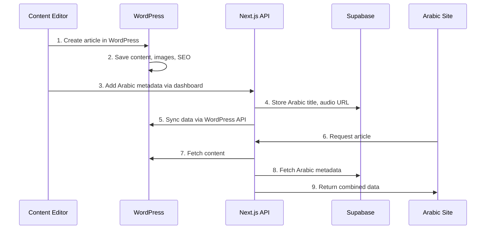
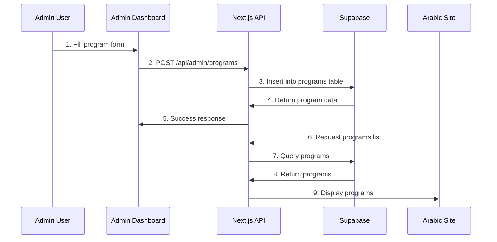

# Zawaya Platform - System Architecture Explained

## 🏗️ **Overall Architecture**

Your Zawaya Platform uses a **Hybrid Content Management System** that combines three main components:

```
┌─────────────────┐    ┌─────────────────┐    ┌─────────────────┐
│   WordPress     │    │    Supabase     │    │ Admin Dashboard │
│   (Articles)    │◄──►│   (Programs)    │◄──►│  (Management)   │
│                 │    │                 │    │                 │
└─────────────────┘    └─────────────────┘    └─────────────────┘
         │                       │                       │
         └───────────────────────┼───────────────────────┘
                                 ▼
                    ┌─────────────────────────┐
                    │    Next.js Frontend     │
                    │   (Arabic Interface)    │
                    └─────────────────────────┘
```

## 🎯 **Role of Each System**

### 1. **WordPress (Headless CMS)**
**Purpose**: Manages long-form content (articles, blog posts)
**Why WordPress**: 
- Excellent content editor (Gutenberg)
- Rich media management
- SEO optimization
- Familiar to content creators

**What it stores**:
- ✅ Article content and HTML
- ✅ Featured images and media
- ✅ Categories and tags
- ✅ Author profiles
- ✅ SEO metadata
- ✅ Publication dates

**WordPress Tables**:
```sql
wp_posts          -- Article content
wp_postmeta       -- Custom fields (Arabic content)
wp_users          -- Authors
wp_terms          -- Categories/Tags
wp_media          -- Images and files
```

### 2. **Supabase (PostgreSQL Database)**
**Purpose**: Manages structured content (programs, episodes, Arabic metadata)
**Why Supabase**:
- Real-time updates
- Built-in authentication
- PostgreSQL power
- Arabic text support
- Row Level Security

**What it stores**:
- ✅ Programs and episodes
- ✅ Arabic translations
- ✅ Audio narrations
- ✅ User preferences
- ✅ Analytics data
- ✅ Comments and interactions

**Supabase Tables**:
```sql
programs          -- TV/Radio programs
episodes          -- Individual episodes
authors           -- Arabic author info
categories        -- Arabic categories
wp_sync           -- WordPress sync data
```

### 3. **Admin Dashboard (Next.js)**
**Purpose**: Unified management interface
**Why Custom Dashboard**:
- Single interface for both systems
- Arabic-first design
- Custom workflows
- Real-time updates

**What it manages**:
- ✅ Programs and episodes
- ✅ WordPress content sync
- ✅ User management
- ✅ Analytics dashboard
- ✅ Content scheduling

## 🔄 **How They Work Together**

### Content Flow Example: Publishing an Article



### Content Flow Example: Adding a Program



## 📊 **Data Flow Patterns**

### Pattern 1: **WordPress-Primary Content** (Articles)
```
WordPress (Source) → Next.js API → Supabase (Metadata) → Frontend
```

**Example**: News article
1. Editor writes article in WordPress
2. WordPress stores: content, images, English metadata
3. Admin adds Arabic metadata via dashboard
4. Supabase stores: Arabic title, audio narration URL
5. Frontend combines both sources

### Pattern 2: **Supabase-Primary Content** (Programs)
```
Admin Dashboard → Next.js API → Supabase (Source) → Frontend
```

**Example**: TV program
1. Admin creates program via dashboard
2. All data stored in Supabase
3. Frontend reads directly from Supabase
4. No WordPress involvement

### Pattern 3: **Hybrid Content** (Enhanced Articles)
```
WordPress (Content) + Supabase (Arabic) → Next.js API → Frontend
```

**Example**: Featured article with audio
1. WordPress: English content, images
2. Supabase: Arabic translation, audio narration
3. API combines both sources
4. Frontend shows bilingual content

## 🛠️ **Admin Dashboard Deep Dive**

### Dashboard Architecture:
```
┌─────────────────────────────────────────────────────────┐
│                 Admin Dashboard                         │
├─────────────────┬─────────────────┬─────────────────────┤
│   Programs      │    Episodes     │     Articles        │
│   Management    │   Management    │   (WP Sync)         │
├─────────────────┼─────────────────┼─────────────────────┤
│ • Create/Edit   │ • Add episodes  │ • Arabic metadata   │
│ • Upload images │ • Video/Audio   │ • Audio narration   │
│ • Set hosts     │ • Thumbnails    │ • Category mapping  │
│ • Scheduling    │ • Transcripts   │ • SEO optimization  │
└─────────────────┴─────────────────┴─────────────────────┘
```

### Dashboard Features:

#### **Programs Tab**:
- ✅ Create new programs with all details
- ✅ Edit existing programs (title, description, host, image)
- ✅ Delete programs (cascades to episodes)
- ✅ Set featured status
- ✅ Manage program status (active/inactive/draft)

#### **Episodes Tab**:
- ✅ Add episodes to programs
- ✅ Upload video/audio files
- ✅ Set episode numbers and seasons
- ✅ Add thumbnails and descriptions
- ✅ Manage publication status

#### **Articles Tab** (WordPress Integration):
- ✅ View WordPress articles
- ✅ Add Arabic metadata
- ✅ Upload audio narrations
- ✅ Map to Supabase categories
- ✅ Sync publication status

## 🔐 **Authentication & Security**

### Admin Access Control:
```
User Request → Middleware → Authentication Check → Role Check → Allow/Deny
```

**Security Layers**:
1. **Middleware**: Checks if user is authenticated
2. **Supabase Auth**: Validates JWT tokens
3. **Role-Based Access**: Checks user permissions
4. **Row Level Security**: Database-level permissions

### Development vs Production:
- **Development**: Authentication disabled for easy testing
- **Production**: Full authentication required

## 📈 **Content Lifecycle**

### 1. **Content Creation**
```
Idea → Planning → Creation → Review → Publishing → Distribution
```

### 2. **Content Management**
```
Draft → Review → Scheduled → Published → Updated → Archived
```

### 3. **Content Analytics**
```
Views → Engagement → Feedback → Optimization → Iteration
```

## 🔄 **Sync Mechanisms**

### WordPress ↔ Supabase Sync:
1. **Webhook Triggers**: WordPress sends notifications on content changes
2. **API Polling**: Periodic checks for new content
3. **Manual Sync**: Admin-triggered synchronization
4. **Real-time Updates**: Supabase real-time subscriptions

### Cache Management:
1. **Next.js Cache**: ISR (Incremental Static Regeneration)
2. **API Cache**: Redis for frequently accessed data
3. **CDN Cache**: CloudFront for static assets
4. **Database Cache**: Supabase connection pooling

## 🎯 **Why This Architecture?**

### **Benefits**:
✅ **Best of Both Worlds**: WordPress content editing + Supabase performance
✅ **Arabic-First**: Native Arabic support throughout
✅ **Scalable**: Each system handles what it does best
✅ **Flexible**: Easy to extend with new content types
✅ **Developer-Friendly**: Modern tech stack
✅ **Content Creator-Friendly**: Familiar WordPress interface

### **Trade-offs**:
⚠️ **Complexity**: Multiple systems to manage
⚠️ **Sync Challenges**: Data consistency across systems
⚠️ **Learning Curve**: Team needs to understand both systems

## 🚀 **Practical Usage**

### **For Content Creators**:
1. **Articles**: Use WordPress admin (familiar interface)
2. **Programs**: Use custom dashboard (Arabic-optimized)
3. **Media**: Upload to WordPress media library
4. **Arabic Content**: Add via custom dashboard

### **For Developers**:
1. **API Integration**: Use Next.js API routes
2. **Database Changes**: Modify Supabase schema
3. **Frontend Updates**: Update React components
4. **Deployment**: Deploy Next.js app + configure databases

### **For Administrators**:
1. **User Management**: Supabase auth dashboard
2. **Content Moderation**: Custom admin dashboard
3. **Analytics**: Built-in dashboard + external tools
4. **Backup**: Automated database backups

This hybrid architecture gives you the flexibility to manage different types of content with the most appropriate tools while maintaining a unified Arabic-first user experience!